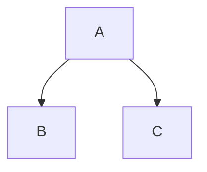

**MARKDOWN**
Declaring heading:

# codespace login
## codespace login
### codespace login

[](https://codespaces.new/Poorna1152/hello-world) 

# hello-world

Font Style:
***
**BOLD**
__Bold__
*italic*
_italic_
***
Quoted text:

> Plus, you'll learn how to work with the popular `github` website to explore existing

Footnote:

This is footnote[^1]. Another footnote[^2].
[^1]: My reference
[^2]: Another reference

Work with code:
`select`

``` js
let x=5;
console.log(x)
```
____
Pointers

- Item One
- item two

1. item one
2. item two
   
* item one
* item two
  - Intended
  - intended
  
 Creating table:
  First|Second|Third
  --|--|--
  1|2|3
  4|5|6

Task list:

- [X] Task1
- [] task 2
   - [] task 2.1

`#FABCDE`

Alert Syntax:

> [!NOTE]
> NOTE

> [!IMPORTANT]
> IMPORTANT

> [!WARNING]
>  WARNING

inline HTML:

Here is a<br />line break

Special content:



Collapsed details:

<details>
<summary>collapsed</summary>

# Header

This is the copy for the collapsed text.
</details>

Links:

https://www.linkedId.com 
Please, [learn](https://www.linkedIn.com) more.

Image:


[Link to Microsoft Training](/training)


